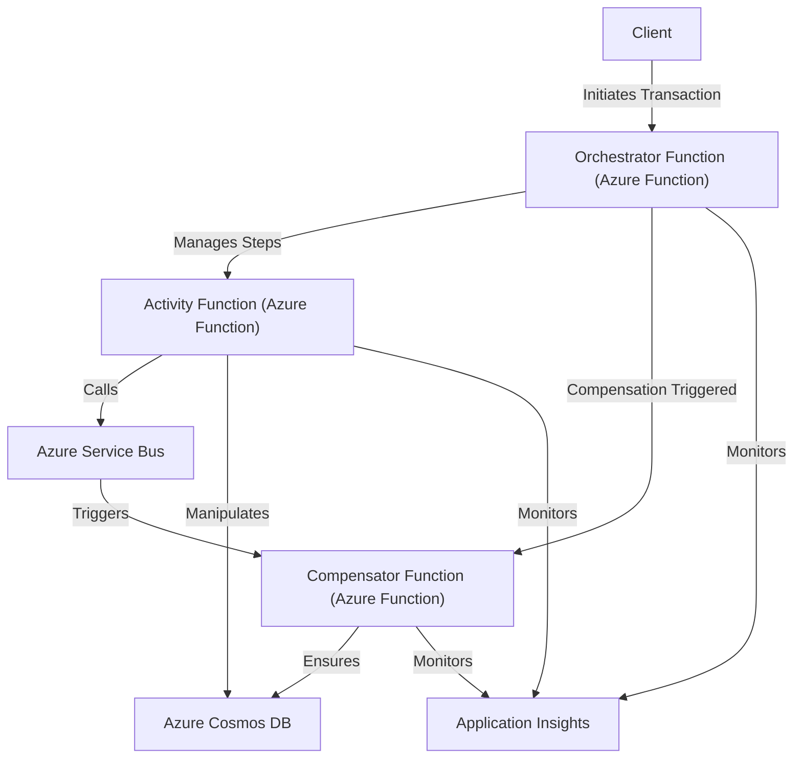

# Saga Distributed Transactions Pattern on Azure

This repository provides an implementation of the **Saga Distributed Transactions Pattern** using Azure services, including Azure Functions, Azure Service Bus, and Azure Cosmos DB. The Saga Pattern is used to manage distributed transactions across multiple microservices, ensuring data consistency and reliability even when some services fail.

## 🏗️ Architectural Overview

The **Saga Pattern** breaks a distributed transaction into a series of smaller transactions that are executed in a sequence. If any transaction fails, the Saga Pattern triggers compensating transactions to undo the changes made by previous steps, ensuring **eventual consistency** across the entire system.

### Architecture Diagram



### Components of the Architecture

1. **Client**: Initiates a transaction request to the **Orchestrator Function**.
2. **Orchestrator Function**: Manages the overall workflow of the Saga, coordinating the execution of the **Activity Function** and triggering the **Compensator Function** in case of a failure.
3. **Activity Function**: Performs individual steps of the transaction, such as processing business logic and writing to **Azure Cosmos DB**.
4. **Compensator Function**: Reverts or compensates for changes if a failure occurs in any step of the Saga.
5. **Azure Service Bus**: Acts as a messaging backbone for communication between functions, triggering compensating transactions when necessary.
6. **Azure Cosmos DB**: Serves as the data store where the transaction data is stored.
7. **Application Insights**: Collects logs, metrics, and telemetry data for monitoring and troubleshooting purposes.

## 📂 Repository Structure

```
/saga-distributed-transactions
│
├── README.md                                # Root README with architecture overview and getting started
├── LICENSE                                  # MIT License
│
├── infrastructure
│   ├── README.md                            # README for Infrastructure deployment
│   ├── azure-resources.bicep                # Bicep template for all Azure resources
│   └── .github/workflows/deploy-bicep.yml   # GitHub Action to deploy Azure resources
│
├── orchestrator-function
│   ├── README.md                            # README for Orchestrator Function
│   ├── orchestrator_function.py             # Python code for Orchestrator Function
│   ├── requirements.txt                     # Dependencies for Orchestrator Function
│   └── .github/workflows/deploy-orchestrator.yml # GitHub Action to deploy the Orchestrator Function
│
├── activity-function
│   ├── README.md                            # README for Activity Function
│   ├── activity_function.py                 # Python code for Activity Function
│   ├── requirements.txt                     # Dependencies for Activity Function
│   └── .github/workflows/deploy-activity.yml # GitHub Action to deploy the Activity Function
│
├── compensator-function
│   ├── README.md                            # README for Compensator Function
│   ├── compensator_function.py              # Python code for Compensator Function
│   ├── requirements.txt                     # Dependencies for Compensator Function
│   └── .github/workflows/deploy-compensator.yml # GitHub Action to deploy the Compensator Function
```

## 🚀 Getting Started

### Step 1: Deploy the Infrastructure

1. Navigate to the **`infrastructure`** folder.
2. Follow the instructions in the [Infrastructure README](infrastructure/README.md) to deploy the required Azure resources using the Bicep template and GitHub Actions.

### Step 2: Deploy the Azure Functions

1. Deploy the **Orchestrator Function**:
   - Navigate to the **`orchestrator-function`** folder.
   - Follow the instructions in the [Orchestrator Function README](orchestrator-function/README.md) to deploy the function using GitHub Actions.

2. Deploy the **Activity Function**:
   - Navigate to the **`activity-function`** folder.
   - Follow the instructions in the [Activity Function README](activity-function/README.md) to deploy the function using GitHub Actions.

3. Deploy the **Compensator Function**:
   - Navigate to the **`compensator-function`** folder.
   - Follow the instructions in the [Compensator Function README](compensator-function/README.md) to deploy the function using GitHub Actions.

### Step 3: Running the Solution

1. **Trigger the Orchestrator Function**:
   - Use an HTTP client (like Postman or `curl`) to send a POST request to the `/startSaga` endpoint of the Orchestrator Function.

2. **Monitor the Workflow**:
   - Check **Application Insights** in the Azure portal for logs and telemetry data to monitor the execution flow and identify any issues.

## 💡 How It Works

1. **Initiate a Transaction**:
   - The **Client** initiates a transaction request to the **Orchestrator Function** by sending an HTTP request with order details.

2. **Orchestrator Function Manages Workflow**:
   - The **Orchestrator Function** processes the request, calls the **Activity Function** to handle the business logic, and waits for a success or failure response.

3. **Activity Function Processes Data**:
   - The **Activity Function** receives the order data and writes it to **Azure Cosmos DB**.
   - If the transaction is successful, it completes the process; if there is an error, the **Compensator Function** is triggered.

4. **Compensator Function Handles Failures**:
   - The **Compensator Function** is triggered if a failure occurs during the transaction.
   - It compensates for the failure by removing or rolling back any changes made to **Azure Cosmos DB**.

5. **Application Insights Monitors the Flow**:
   - All functions log their activities to **Application Insights** for monitoring and troubleshooting purposes.

## 📝 About the Saga Pattern

The **Saga Pattern** is a design pattern for managing distributed transactions in microservices architecture. It breaks down a large transaction into smaller sub-transactions that are executed in a sequence, ensuring eventual consistency across the system.

- **Resilience**: By breaking down transactions into smaller steps and defining compensating actions, the Saga Pattern helps systems recover from failures gracefully.
- **Scalability**: Decoupling transactions across services improves scalability, allowing independent scaling of microservices.
- **Flexibility**: The Saga Pattern supports various consistency models, including eventual consistency, which is crucial for distributed systems.

## 📄 License

This project is licensed under the MIT License - see the [LICENSE](LICENSE) file for details.

## 🙌 Contributing

Contributions are welcome! Please open an issue or submit a pull request for any improvements or suggestions.
